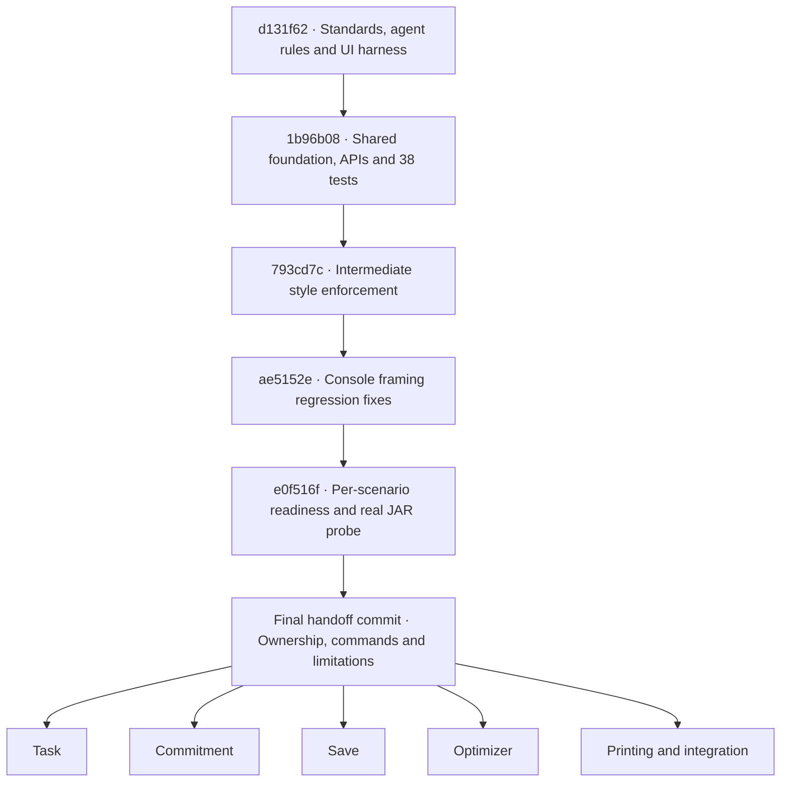

# ScheduleFlow starter handoff

This is a compiling shared foundation, **not a functionally complete
application**. All public declarations from contract version 1 (27 September
2026) exist. Thirty-two feature methods deliberately throw
`UnsupportedOperationException` with `TODO(Owner): implement Type.method`.

Read the [original contract](ScheduleFlow-Implementation-Contract.docx) or its
[complete extracted text](ScheduleFlow-Implementation-Contract.txt), including
sections 1-3, your role and 14-16. The DOCX copy is byte-for-byte identical to
the supplied attachment (SHA-256
`587778cec8c12750ea999ecee8205f6e3e8651bca3719bec12de18141bb19f8e`).
The text preserves paragraph order, including table cells; use the DOCX when
table layout matters. The contract's separately mentioned user guide was not
part of this task's supplied files and has not been edited.

## Build and verification

Use JDK **25**. This handoff was checked on Microsoft OpenJDK 25.0.4.1.
Gradle 9.6.1, Shadow 9.5.1, JUnit 5.14.4 and Checkstyle 14.1.0 are retained
from the fork. Gradle now also selects a Java 25 toolchain and release 25;
Java source encoding is UTF-8. Do not silently downgrade the runtime.

From the repository root on Windows:

```powershell
java -version
.\gradlew.bat build
.\gradlew.bat test
.\gradlew.bat checkstyleMain checkstyleTest
.\gradlew.bat shadowJar
node --test test/ui-runner.test.mjs
node .agents/skills/test-ui/scripts/run-ui-tests.mjs
```

Use `./gradlew` on Unix. On macOS, switch with
`sdk use java 25.0.3.fx-zulu` when needed. The Node runner needs Node.js 22+;
it uses only built-in modules (no npm install). Import as a Gradle project
in IntelliJ with SDK 25.

If Gradle selects an unwritable cache, set a writable user cache explicitly,
for example `$env:GRADLE_USER_HOME = "$env:USERPROFILE/.gradle"` in PowerShell.
This session's default was incorrectly resolved to `C:\.gradle`; using
`C:/Users/kohka/.gradle` resolved it without changing project dependencies.

The packaged application is `build/libs/scheduleflow.jar`, with manifest
`Main-Class: scheduleflow.Main`. Future production invocation is
`java -jar /absolute/path/to/scheduleflow.jar`, with no application arguments.
Its eventual data path is relative to the launch directory:
`data/scheduleflow.txt`. At this stage Main is a deliberate stub; running
the JAR exits 1 with that exception and proves no feature works.

## Exact ownership

All source paths below are relative to `src/main/java/scheduleflow/`.
Corresponding tests are under `src/test/java/scheduleflow/`.

| Role | Owned files |
| --- | --- |
| Task | `common/InputRules.java`, `common/ValidationException.java`, `model/Task.java`, `task/TaskService.java` |
| Commitment | `model/Commitment.java`, `commitment/CommitmentService.java` |
| Save | `model/Snapshot.java`, `storage/Storage.java`, `storage/FileStorage.java`, `storage/StateCodec.java`, `storage/StorageException.java` |
| Optimizer | `planning/TimeRules.java`, `planning/StudySession.java`, `planning/UnallocatedReason.java`, `planning/UnallocatedWork.java`, `planning/Plan.java`, `planning/Planner.java`, `planning/EarliestDeadlinePlanner.java`, `planning/SlotKind.java`, `planning/ScheduleEntry.java`, `planning/ScheduleView.java`, `planning/ScheduleService.java` |
| Printing | `Main.java`, `cli/AppState.java`, `cli/Command.java`, `cli/CommandParser.java`, `cli/ParseException.java`, `cli/CommandResponse.java`, `cli/CommandDispatcher.java`, `cli/ConsoleUi.java`, `cli/App.java`, `cli/TextRenderer.java` |

Printing maintains the build entry point, `test/ui-test-plan.md`,
`test/ui-scenarios.json` and the UI runner. Standards and shared build
configuration are team-maintained. Save and Printing jointly cover save
rollback; Optimizer and Printing jointly cover allocation output.
Existing `PlanningRecordsTest` belongs to Optimizer; CLI contract and live
state tests belong to Printing. Other existing tests mirror their model owner.

## Implemented foundation

- InputRules strips names, preserves internal text, rejects slash/control
  characters, and checks positive slot-multiple durations.
- Task and Commitment validate structural fields and stable Tn/Cn identity.
  Commitment uses half-open weekly intervals, permits adjacency and midnight
  endpoints, and guards duration overflow.
- Snapshot copies lists, preserves order, rejects duplicate IDs, bad counters
  and overlapping commitments, and supports overdue saved tasks.
- TimeRules defines shared windows/slots, the rolling calendar year and exact
  cutoff rounding, including seconds, nanoseconds and leap-day adjustment.
- All planning records/enums validate their own fields and copy lists.
  Plan validates its supplied horizon and sorted results without repairing
  them. ScheduleView requires complete contiguous coverage of its chosen
  window. Cross-record task matching, deadline eligibility, commitment/session
  collision checks and minute conservation remain the planner's responsibility.
- Command and all eleven nested records preserve the agreed vocabulary;
  they check null references without duplicating business validation.
- All exception classes, CommandResponse and AppState are implemented.
  A saved commit clears the plan; replacement preserves snapshot identity.
- Storage and Planner interfaces are ready. All constructors initialize their
  fields without I/O or invoking stubs; FileStorage normalizes its supplied
  path to an absolute path.

## Remaining feature methods

| Owner | Intentionally unfinished methods |
| --- | --- |
| Task (3) | `TaskService.add`, `delete`, `list` |
| Commitment (3) | `CommitmentService.add`, `delete`, `list` |
| Save (4) | `FileStorage.load`, `save`; `StateCodec.encode`, `decode` |
| Optimizer (2) | `EarliestDeadlinePlanner.generate`; `ScheduleService.forDate` |
| Printing (20) | `CommandParser.parse`; `CommandDispatcher.execute`; `ConsoleUi.prompt`, `readLine`, `write`; `App.run`; `Main.main`; all 13 TextRenderer methods below |

The renderer stubs are `help`, `taskAdded`, `taskDeleted`, `tasks`,
`commitmentAdded`, `commitmentDeleted`, `commitments`, `plan`, `schedule`,
`noPlan`, `error`, `parseError`, and `exit`.
Locate remaining work with `rg 'TODO\(' src/main/java`.

## Skills and persistent instructions

Codex discovers repository skills under `.agents/skills` while walking from
the working directory to the repository root. This follows the
[official discovery documentation](https://learn.chatgpt.com/docs/build-skills).
Load these files explicitly if the session catalog has not refreshed:

| Skill | Location and use |
| --- | --- |
| `seedu-java-coding-standard` | `.agents/skills/seedu-java-coding-standard/SKILL.md`; load for all Java, including tests; review its linked code-quality checklist |
| `seedu-git-standard` | `.agents/skills/seedu-git-standard/SKILL.md`; load before every commit |
| `test-ui` | `.agents/skills/test-ui/SKILL.md`; review/update the plan and invoke after every coherent code update |

These skills are committed in this repository, with no global project-rule
installation. A global MoistBot skill also named test-ui is unrelated: use
the ScheduleFlow path explicitly. Root AGENTS.md preserves the original
instructions and adds this workflow. Nested instructions under
`src/main/java/scheduleflow/AGENTS.md` and `src/test/AGENTS.md` reinforce
ownership and deterministic testing.

The SE [Java standard](https://se-education.org/guides/conventions/java/intermediate.html),
[Git conventions](https://se-education.org/guides/conventions/git.html),
and [CS2113 quality guidelines](https://nus-cs2113-ay2627-s1.github.io/website/se-book-adapted/chapters/codeQuality.html)
were read. Uncovered Java topics use the guide's specified
[Google fallback](https://google.github.io/styleguide/javaguide.html).
Skills distinguish source requirements, recommendations and stronger local
workflow requirements. Checkstyle enforces mechanical rules, including
intermediate continuation/switch indentation and documentation; it is not a
substitute for reviewing names, intent and design.

Two explicit style exceptions preserve the contract: noun-like shared APIs
and record accessors keep their exact names, and ownership TODO markers use
the requested format instead of Google's newer linked-TODO format. No public
declaration was renamed for style. No unresolved public API mismatch is known.

## UI readiness and evidence

The runner builds the current code, checks Java 25, selects readiness using
each fixture's required methods, and runs the real JAR. Scenarios use isolated
temporary directories and send/check one command at a time. No dynamic
placeholders are supported. See the [UI plan](../test/ui-test-plan.md) for the
full schema, exact comparisons, setup and timeout behavior.

UI-001 (first launch), UI-002 (commitment identity/restart), UI-003 (EOF), and
UI-004 (corrupt startup) are **planned and blocked by required stubs**.
There are zero feature passes and zero executed feature failures.
The separate real-JAR scaffold probe records the actual Main exception and
exit 1; it is diagnostic evidence, never a successful acceptance test.
Runner exit 2 means BLOCKED; exit 1 means FAILED; exit 0 means its active
scenarios passed. Ready planned cases still require review and activation.
A stub in an unrelated module cannot excuse an active scenario failure.

A01-A23 in the contract remain release acceptance criteria, not completed
features. Fixed-clock application tests and fake-storage rollback tests are
deferred to their owners. The planned UI error wording for UI-004 is a proposed
regression baseline; the contract allows clearer wording.

Transcripts live under ignored `build/ui-transcripts/`, with each run printing
its exact path. They include inputs, stdout, stderr, exit status, missing
methods and unexecuted IDs. Gradle `clean` deletes build artifacts and old
transcripts; copy evidence elsewhere if it must survive a clean build.

Verification performed during this task:

| Check | Result |
| --- | --- |
| Original fork baseline | Java 25 build, 1 trivial test and Checkstyle passed after correcting the cache path |
| `gradlew.bat clean build` after foundation creation | Passed: 38 meaningful JUnit tests, Checkstyle and packaging |
| `gradlew.bat check shadowJar` after style enforcement | Passed: all 38 tests and expanded checks |
| `node --test test/ui-runner.test.mjs` | 12 harness tests passed; these are not ScheduleFlow feature acceptance |
| `quick_validate.py` on all three skills | Passed after placing missing PyYAML in ignored `build/skill-validation` only |
| `javap -public` on all top-level and nested Command types | Reviewed against required names, parameters, returns and checked exceptions |
| JAR manifest and isolated real startup | Entry point matches; intended Main stub exits 1 |
| UI sessions after each coherent update | BLOCKED, with maintained scenarios unexecuted |
| Staged diff/whitespace reviews | Passed before each commit |

The first quality-page request returned a web-tool access error; direct HTTPS
retrieval then succeeded. The initial sandbox process helper also failed;
authorized commands subsequently completed through the permitted execution
path. No required source remains inaccessible, and Java was never downgraded.

## Branching and integration

The final starter checkpoint is the commit titled
`Document ScheduleFlow starter handoff`, which introduces this file.
At handoff, get its full hash with:

```text
git log -1 --format=%H -- docs/STARTER.md
git switch -c implement-task <starter-hash>
```

The first command identifies the checkpoint; the second creates a role branch
from it. Use `implement-commitment`, `implement-save`, `implement-optimizer`
or `implement-printing` as appropriate. All five members should start from
the same final hash reported with this handoff, including standards and
testing support, rather than an intermediate foundation commit.

Implement only owned files and tests. Preserve package names, record
component names/types/order, parameter order, returns, checked exceptions
and constructor behavior. Coordinate incompatible changes with every affected
owner and update the contract and callers together.

Follow candidate creation → save(candidate) → state.commit(candidate) →
success output. Services never publish live state. Planning replaces only the
plan. Complete feature tests and acceptance cases before claiming the MVP
works. Review the UI plan and invoke test-ui after each coherent code change;
commit significant verified work locally with explanatory bodies. No push,
merge or history rewriting was performed during this task.

## Change map

The requested `/present-changes-visually` skill was not found in the installed
skill directories, plugin caches or skill contents. It was not invoked.
This standard diagram and commit list are the fallback handoff.



All six commits are local. The final commit's hash is supplied in the task
completion report; its hash cannot be embedded in its own contents.
